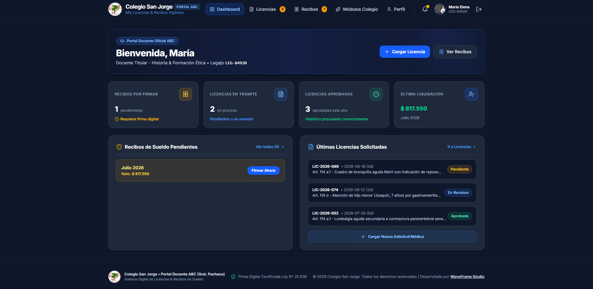
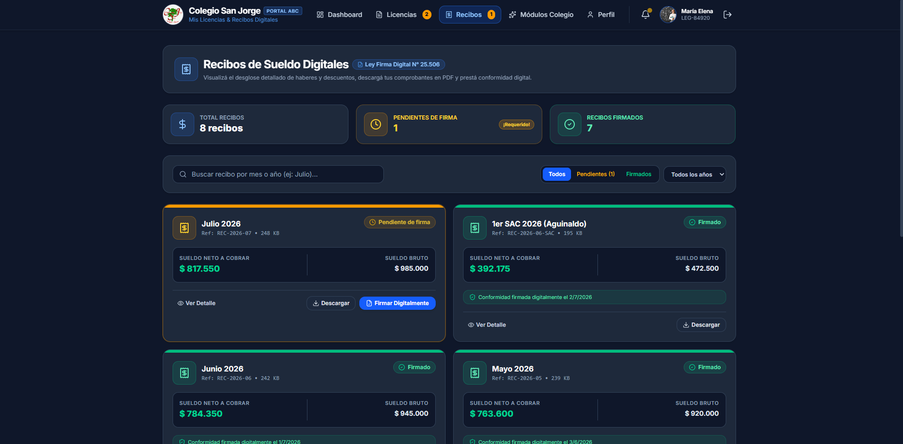
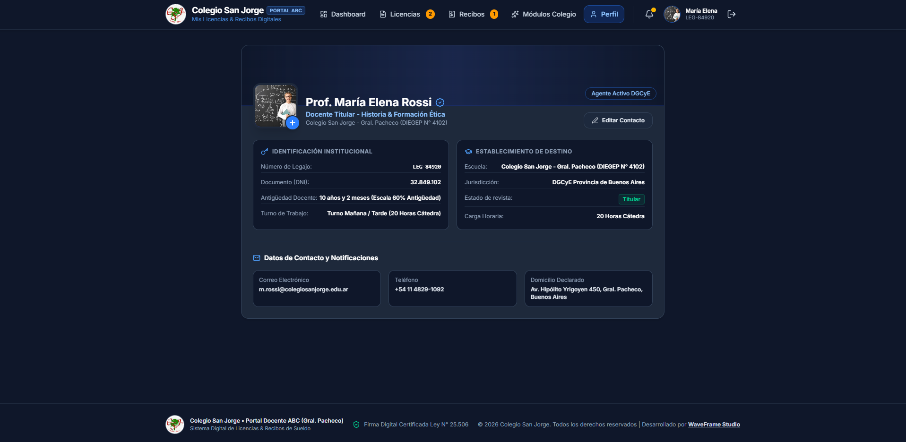

  

  # 🏫 Colegio San Jorge — Portal Docente ABC
  **Plataforma Institucional Digital de Licencias & Recibos de Sueldo**

  

    
    
    
    
    
  

  

    Sistema integral para docentes y personal administrativo del <b>Colegio San Jorge (Gral. Pacheco - DIEGEP N° 4102)</b>. Permite la gestión ágil de licencias médicas, visualización y firma digital de recibos de haberes bajo normativa DGCyE (Ley N° 25.506).
  

---

## ✨ Características Principales

- 📑 **Gestión Digital de Licencias**: Tramitación simplificada de licencias médicas (Art. 114 a.1, Art. 114 o, Art. 114 n.1) con carga de adjuntos y seguimiento de estado en tiempo real (*Pendiente*, *En Revisión*, *Aprobada*).
- 🧾 **Recibos de Haberes Digitados**: Consulta de liquidaciones de sueldo con desglose de haberes, descuentos y firma digital legalmente válida.
- 👤 **Perfil del Agente & Legajo**: Gestión de datos de contacto, legajo docente, turno y personalización de foto de perfil con almacenamiento persistente.
- 📱 **Diseño Responsive & Modos Oscuros**: Interfaz optimizada para computadoras, tablets y dispositivos móviles con estética Dark Mode y componentes de alta calidad.
- 🔒 **Firma Digital Certificada**: Conformidad integral con la Ley N° 25.506 de Firma Digital y regulaciones de la DGCyE de la Provincia de Buenos Aires.

---

## 📸 Galería de la Aplicación

<table width="100%" align="center">
  <!-- Fila 1: 2x2 -->
  <tr>
    <td width="50%" align="center" valign="top">
      
        
      <b>🔒 Acceso Seguro al Portal</b>
    </td>
    <td width="50%" align="center" valign="top">
      
        
      <b>📊 Dashboard Principal & Indicadores</b>
    </td>
  </tr>

  <!-- Fila 2: 2x2 -->
  <tr>
    <td width="50%" align="center" valign="top">
      
        
      <b>📑 Trámite & Solicitud de Licencias</b>
    </td>
    <td width="50%" align="center" valign="top">
      
        
      <b>🧾 Recibos de Haberes & Firma Digital</b>
    </td>
  </tr>

  <!-- Fila 3: 2x2 -->
  <tr>
    <td width="50%" align="center" valign="top">
      
        
      <b>👤 Perfil Docente & Legajo Personal</b>
    </td>
    <td width="50%" align="center" valign="top">
      
        
      <b>Sparkles Módulos & Portal Institucional</b>
    </td>
  </tr>
</table>

---

  © 2026 **Colegio San Jorge** • Todos los derechos reservados  
  *Desarrollado por [**WaveFrame Studio**](https://waveframe.com.ar/)*

